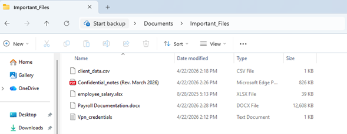
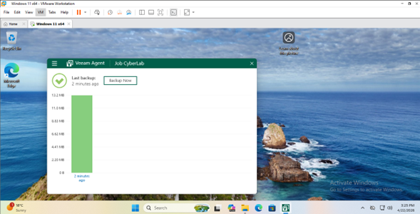
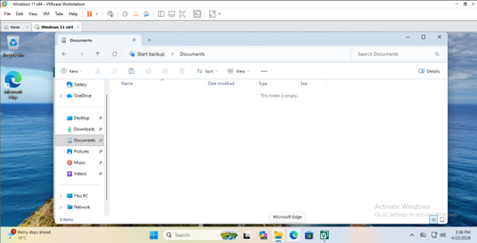
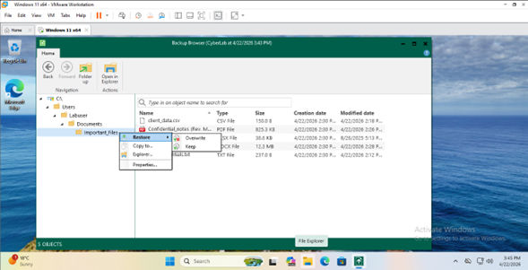
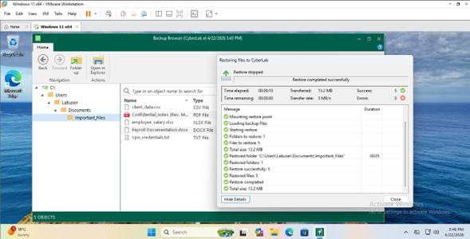

📌 Project: Veeam Backup & Recovery Lab

🧠 Objective

Simulate a real-world data loss scenario and perform file-level recovery using Veeam Agent in a virtual environment.

🛠️ Tools Used

Veeam Agent for Microsoft Windows
VMware Workstation
Windows 11 Virtual Machine

🧪 Scenario

A simulated ransomware/data loss incident was created by deleting critical user files.

📂 Files Protected

Payroll.xlsx
Passwords.txt
Payroll Documentation.docx
rooms.csv
Form 941 (PDF)

💾 Backup Configuration

Backup type: File-level backup
Target: Local storage
Scope: Important_Files folder

💥 Incident Simulation

The folder Important_Files was deleted to simulate data loss.

♻️ Recovery Process

Used Veeam file-level restore to recover deleted files from backup.

✅ Results

Successfully restored all deleted files
Data integrity maintained
Demonstrated effective backup and recovery workflow

